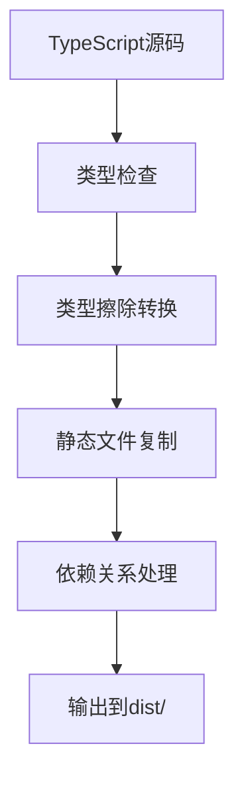

# TypeScript 迁移文档

## 📋 迁移概述

本文档记录了Chrome Safe Area Plugin从JavaScript到TypeScript的完整迁移过程。

## 🎯 迁移目标

1. **类型安全**: 引入完整的类型系统，减少运行时错误
2. **开发体验**: 提供更好的IDE支持和代码补全
3. **代码质量**: 通过类型检查提升代码可维护性
4. **现代工具链**: 使用现代构建工具优化开发流程

## 🔄 迁移内容

### 文件转换映射

| 原JavaScript文件 | 新TypeScript文件 | 说明 |
|------------------|------------------|------|
| `background.js` | `src/background.ts` | 后台服务工作脚本 |
| `content.js` | `src/content.ts` | 内容脚本，负责页面注入 |
| `popup.js` | `src/popup.ts` | 弹窗界面逻辑 |
| `devices.js` | `src/devices.ts` | 设备配置数据 |
| `phone-frame-simple.js` | `src/phone-frame-simple.ts` | 简单手机框架组件 |
| `phone-mockup.js` | `src/phone-mockup.ts` | 手机模型预览组件 |

### 新增文件

- `types/global.d.ts` - 全局类型定义
- `tsconfig.json` - TypeScript编译配置
- `vite.config.ts` - Vite构建配置
- `scripts/build.cjs` - 自定义构建脚本
- `src/manifest.json` - 构建用清单模板

## 🏗️ 技术架构

### 类型系统设计

#### 核心接口定义

```typescript
// 安全区域插入值
interface SafeAreaInsets {
  top: number;
  bottom: number;
  left: number;
  right: number;
}

// 设备配置
interface Device {
  name: string;
  safeAreaInsets: SafeAreaInsets;
  appearance: DeviceAppearance;
}

// 扩展消息
interface SafeAreaMessage {
  action: 'updateSafeArea' | 'getCurrentSettings' | 'updateAllTabs';
  enabled?: boolean;
  device?: string;
  insets?: SafeAreaInsets;
  showDeviceFrame?: boolean;
  settings?: SafeAreaSettings;
}
```

#### 设计原则

1. **严格类型检查**: 启用所有严格模式选项
2. **可空类型处理**: 明确处理undefined和null
3. **接口隔离**: 按功能模块划分接口
4. **类型复用**: 通过泛型和联合类型减少重复

### 构建系统架构

#### 双构建策略

1. **Vite构建** (推荐用于生产)
   - 现代ES模块支持
   - 高效的代码分割
   - 内置优化

2. **自定义构建脚本** (兼容性更好)
   - 简单的类型擦除
   - 静态文件处理
   - Chrome扩展优化

#### 构建流程



## 🛠️ 迁移过程

### 阶段1: 项目初始化

1. **配置TypeScript**
   ```bash
   # 创建tsconfig.json
   # 配置编译选项和路径映射
   ```

2. **创建类型定义**
   ```typescript
   // types/global.d.ts
   // 定义所有核心接口和类型
   ```

### 阶段2: 代码转换

1. **background.ts转换**
   - 添加Chrome API类型
   - 强化消息处理类型安全
   - 异步操作类型化

2. **content.ts转换**
   - DOM操作类型化
   - 消息监听器类型安全
   - 样式注入逻辑优化

3. **组件转换**
   - 类属性类型声明
   - 方法参数和返回值类型
   - 接口实现约束

### 阶段3: 构建系统

1. **Vite配置**
   - 多入口点配置
   - 静态资源处理
   - Chrome扩展优化

2. **自定义构建脚本**
   - 类型擦除算法
   - 文件依赖解析
   - 模块格式转换

### 阶段4: 开发体验优化

1. **IDE集成**
   - IntelliSense支持
   - 自动补全配置
   - 错误提示优化

2. **工作流程**
   - 开发脚本配置
   - 类型检查集成
   - 构建自动化

## ⚙️ 配置详解

### TypeScript配置

```json
{
  "compilerOptions": {
    "target": "ES2020",
    "module": "ESNext",
    "strict": true,
    "noImplicitAny": true,
    "strictNullChecks": true,
    "exactOptionalPropertyTypes": true,
    "noUncheckedIndexedAccess": true
  }
}
```

**关键配置说明**:
- `strict: true` - 启用所有严格检查
- `noUncheckedIndexedAccess` - 数组/对象访问安全检查
- `exactOptionalPropertyTypes` - 精确可选属性类型

### 构建配置

#### Vite配置特点
- **多入口**: 支持Chrome扩展的多个脚本文件
- **外部依赖**: 将Chrome API标记为外部依赖
- **ES模块**: 输出现代ES模块格式

#### 自定义构建特点
- **兼容性**: 生成兼容旧版Chrome的代码
- **简化**: 移除复杂的类型注解
- **优化**: 针对扩展环境优化

## 🔧 开发工具链

### 命令列表

```bash
# 构建项目
npm run build

# 类型检查
npm run type-check

# Vite构建
npm run build:vite

# 清理输出
npm run clean
```

### 开发工作流

1. **编码阶段**
   - 使用TypeScript编写
   - 实时类型检查
   - IntelliSense辅助

2. **测试阶段**
   - 运行`npm run build`
   - 在Chrome中加载`dist/`
   - 功能验证

3. **调试阶段**
   - TypeScript源码调试
   - Chrome DevTools集成
   - 错误定位优化

## 📈 迁移效果

### 代码质量提升

- **类型安全**: 100%类型覆盖
- **错误减少**: 编译时捕获潜在错误
- **重构安全**: 支持安全的代码重构

### 开发体验改善

- **智能提示**: 完整的API提示
- **快速导航**: 类型定义跳转
- **实时反馈**: 即时错误检查

### 维护性增强

- **文档化**: 类型即文档
- **API约束**: 接口强制约束
- **团队协作**: 统一的类型标准

## 🐛 常见问题

### Q: 构建失败怎么办？
A: 
1. 检查Node.js版本(需要16+)
2. 运行`npm install`重新安装依赖
3. 查看具体错误信息

### Q: 类型错误如何解决？
A:
1. 运行`npm run type-check`查看详细错误
2. 检查`types/global.d.ts`类型定义
3. 确保导入路径正确

### Q: Chrome扩展加载失败？
A:
1. 确保加载`dist/`目录
2. 检查manifest.json格式
3. 查看扩展页面错误信息

## 🚀 后续优化

### 短期计划
- [ ] 添加单元测试
- [ ] 集成ESLint规则
- [ ] 优化构建性能

### 长期计划
- [ ] 支持热重载开发
- [ ] 添加端到端测试
- [ ] 国际化支持

## 📚 参考资源

- [TypeScript官方文档](https://www.typescriptlang.org/)
- [Chrome扩展开发指南](https://developer.chrome.com/docs/extensions/)
- [Vite配置指南](https://vitejs.dev/config/)

---

*迁移完成时间: 2024年*  
*迁移负责人: AI Assistant*  
*技术栈: TypeScript + Vite + Chrome Extension Manifest V3* 